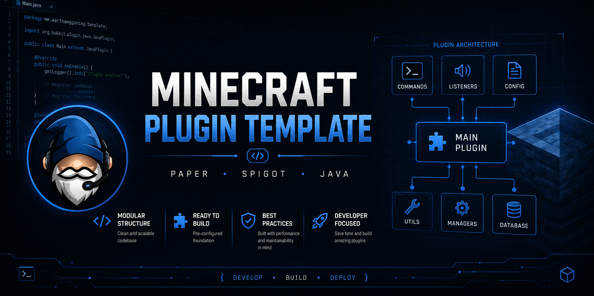

  

# Minecraft Plugin Template

Template and starter framework for developing Minecraft Java plugins using Paper and Spigot APIs.

---

## Included Features

- Standard plugin structure
- Plugin configuration setup
- Command registration examples
- Permission examples
- Event listener structure
- Paper / Spigot support
- Gradle build support

---

## Purpose

This repository is designed to speed up development for future Minecraft Java plugins.

---

## Planned Additions

- Config manager
- Logging utilities
- Reload handling
- Command framework
- Permission utilities
- GUI systems
- Database support

---

## Compatibility

- Minecraft Java Edition
- Paper
- Spigot

---

## Status

Active development template.
